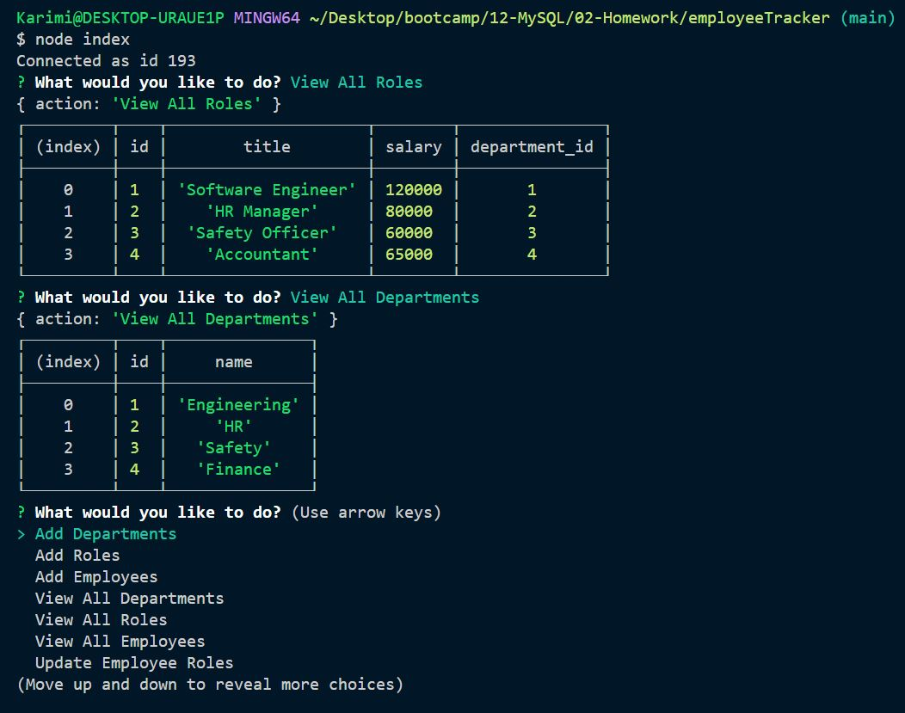

# Employee Tracker

As a business owner,
I want to be able to view and manage the departments, roles, and employees in my company
So that I can organize and plan my business

[Link to Video](https://drive.google.com/file/d/1RBVWuEX-ANJEEYTHNqYc3O5mDu1Vw6cy/view?usp=sharing)

## Table of Content
* [Description](#Description)

* [Installation](#Installation)

* [Question](#Question)

## Description
  To architect and build a solution for managing a company's employees using node, inquirer, and MySQL.
   

## Installation:
After download the project, run `npm install` in terminal. Do not forget to run it at the same directory which your downloaded folder is. Then, write `node index.js` to run! 

## Question?
If you have any question or require any further information, feel free to contact me. 

GitHub: https://github.com/karimi65

Email: ali216k@gmail.com